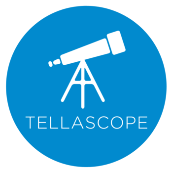

tellascope
##Logo

##Summary
 
Tellascope is social news discovery for the intellectually curious. We are focused on giving millennials the tools they need to spend less time scrolling and more time reading. With our initial push in the Pocket community along with our branding towards thought provoking and stimulating content, we are focused on creating a community of people reading and sharing quality content.
	
##Customer Segment and Use Case

Our customer segment is millennials who are avid news readers. At launch we have built in integration with Pocket, a popular read it later service, in order to bias our content away from the typical clickbait you see on Facebook and Twitter. We found that most millennials fall under one of three categories: The very active news nerds, the socially active reader, and the passive reader who consumes select articles that are given to them (through friends or social media).

##Value proposition

We help millennials:

* Discover and consume new content
* Streamline the process of finding, sharing, and saving content
* Obtain a social context around articles

##Key technologies
Our key technologies are as follows:

* Django
* Heroku
* PostgresSQL
* Sass
* Grunt
* JavaScript

##Names of team members
* Nicole Zhu
* Alex Duner
* Eric Swank
* Adam Morabito
* Brian Lichliter

##Names of former team members
* Karen Wang
* Lindsay Saran

## Key Resources
* [Google Drive](https://drive.google.com/folderview?id=0B1MgrVuuAI0MflBUZzNqT1d0N2xxa25KazdqSjJGYktmUzBBTlY2SmJyT1p2TERmSWZUQkk&usp=sharing)


=======
=======

## Requirements

- `virtualenv` and `virtualenvwrapper`

## Getting started
Please note – this guide assumes you are using OS X. If you aren't, you hopefully know the equivalent commands to make these things happen. If you don't, find someone to help you! Yay learning!

First clone this project.

```bash
git clone git@github.com:nuvention-web/dac.git
cd dac
```

Then, create the virtual environment for your project.

```bash
mkvirtualenv tellascope
add2virtualenv .
```

Add this to your `~/.virtualenvs/tellascope/bin/postactivate` file:
```bash
export DJANGO_SETTINGS_MODULE=tellascope.config.settings.development
```

And install the requirements:

```bash
pip install Django==1.7
pip install -r requirements.txt
```

Note: Django is not in the requirements because django-faker requires it to be installed before it can be installed.

Now create the database (this assumes you have postgres installed) and run Postgres:

```bash
createdb tellascope
pgup
```

```
export DJANGO_SETTINGS_MODULE=tellascope.config.settings.development
```

You should be able to run your first `migrate` now:

```bash
django-admin makemigrations
django-admin migrate
```

And import the test data:

```bash
python manage.py import_mvp_data tellascope/core/management/commands/mvp_data.csv
 ```

You will also need to install Grunt and other Node dependencies to compile the Sass (this assumes you already have `node` and `grunt-cli` installed).

```bash
npm install
grunt dev
```

Do some things for Django static files:
```
sudo mkdir -p /var/www/tellascope/static/ && sudo chmod -R 777 /var/www/tellascope/static/
django-admin collectstatic
```

Then, you should be able to run the server:

```bash
django-admin runserver
```

To deploy:

```bash
git push heroku dev:master
```
